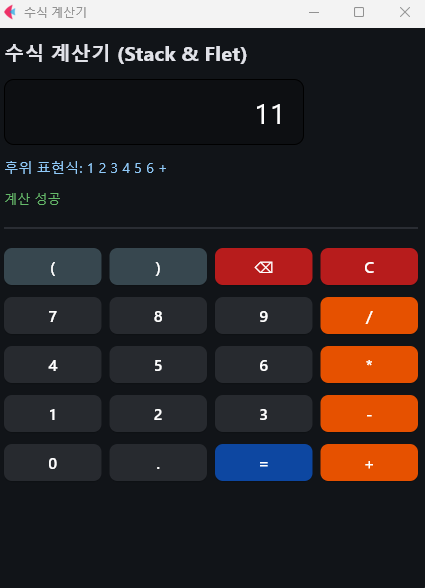

# 🐍 파이썬 자료구조 및 알고리즘

---

## 🛠️ 개발 환경 및 사용 도구
* **언어 (Language):** Python 3.11
* **가상환경 (Environment):** Anaconda (Env Name: `cv`)
* **IDE:** Visual Studio Code (통합 CMD 터미널)
* **GUI 라이브러리:** Tkinter (순정 그래픽 드라이버 엔진)

---

## 📂 과제별 파일 구성 및 실행 방법

터미널 구동 시 아래 **초기 환경 세팅 명령어**를 먼저 입력한 후 실행하시기 바랍니다.

```cmd
:: VS Code 통합 터미널(CMD) 전용 가상환경 활성화 및 다운로드 폴더 진입 명령어
conda activate cv
cd "C:\Users\AISW_203_112\Downloads\5.28 김찬수교수님 리스트,집합,스택,수식계산기,미로탐색,라인편집기"
```

---
### 🔹 01_리스트
* 소스코드: 01_리스트/ListClass.py

* 실행 화면: 01_리스트/01_List_Class.png

* 설명: 선형 자료구조의 기초가 되는 리스트(List) 구조를 파이썬 클래스로 직접 설계하고 검증했습니다.

### 🔹 02_라인편집기
* 소스코드: 02_라인편집기/LineEditor.py

* 실행 화면: 02_라인편집기/02_LineEditor.png

* 설명: 리스트 알고리즘을 응용하여 텍스트 라인을 삽입, 삭제, 수정할 수 있는 정적 라인 편집기 프로그램을 구현했습니다.

### 🔹 03_집합
* 소스코드: 03_집합/SetClass.py

* 실행 화면: 03_집합/03_Set_Class.png

* 설명: 중복을 허용하지 않는 집합(Set) 자료구조를 구현하고 합집합, 교집합, 차집합 등의 연산을 클래스 메서드로 정의했습니다.

### 🔹 04_스택
* 소스코드: 04_스택/StackClass.py

* 실행 화면: 04_스택/04_Stack_Class.png

* 설명: 후입선출(LIFO) 구조의 기본 스택(Stack)을 구현하고 push, pop 연산의 데이터 흐름을 추적했습니다.

### 🔹 05_수식 계산기
* 소스코드: 05_수식 계산기/Postfix.py

* 실행 화면: 05_수식 계산기/05_Postfix.png

* 설명: 스택 자료구조를 응용하여 중위 표기법 수식을 후위 표기법으로 변환하고 최종 결과를 연산하는 수식 계산기를 구현했습니다.

### 🔹 06_미로탐색
* 소스코드: 06_미로탐색/DFS.py

* 실행 화면: 06_미로탐색/06_DFS(1).png, 06_미로탐색/06_DFS(2).png

* 설명: 직접 구현한 Stack 구조를 응용하여 6x6 격자 미로를 깊이 우선 탐색(DFS)하는 과정을 실시간 애니메이션으로 시각화했습니다.

* 트러블 슈팅 (핵심 요약): 기존 Flet 라이브러리가 특정 Windows 하드웨어 가속 드라이버 및 아나콘다의 환경 변수 체계와 충돌하여, 창 내부 컴포넌트 렌더링을 연산하지 못하고 화면 전체가 회색으로 굳어버리는 결함을 진단했습니다.
이를 해결하기 위해 외부 의존성이 없고 시스템 가속 충돌 우려가 전혀 없는 파이썬 순정 그래픽 엔진인 Tkinter 구조로 코드를 전면 리팩토링했습니다. 추가로, 시간 지연(time.sleep) 연산 중 UI가 멈추지 않도록 threading(멀티스레드) 기술을 결합하여 100% 안정적인 화면 출력과 부드러운 패스 트래킹 시각화를 완벽히 구현해 냈습니다.

---

### 📺 과제 실행 화면 (Screenshots)
📸 01. 리스트 클래스 결과


📸 02. 라인 편집기 결과
📸 03. 집합 클래스 결과
📸 04. 스택 클래스 결과
📸 05. 후위 표기법 계산기 결과


📸 06. 미로 탐색 (DFS) 애니메이션 과정 및 최종 성공 화면
